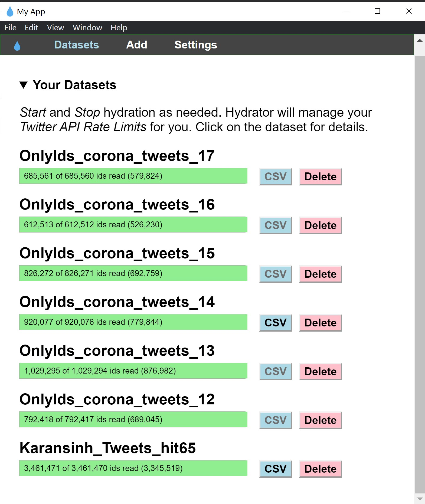

For the past couple of weeks I've been working on Tweeter data for various projects, which included a collection of historical tweets, based on specific hashtags. Further, you may be aware that Twitter's search API limits searches to only the past week or so, which sucks for those doing historical research. Twitter also says that if you've collected a pile of tweets, you can't post them for someone else to download, you can only post a file of the tweet-ids.

While working on COVID-19 data, I came across similar tweet-id data collected by the model deployed here at https://live.rlamsal.com.np by Mr. Rabindra Lamsal (JNU, New Delhi). The model monitors the real-time Twitter feed for coronavirus-related tweets, using filters: language “en”, and keywords “corona”, "coronavirus", "covid", "covid19" and variants of "sarscov2". (Note: This dataset should be solely used for non-commercial research purposes). This model adds tweet ids every day.

While working on this type of data, the biggest challenge I faced was to "hydrate" the tweet-ids contained in the CrisisLex files in order to get the actual details of the original tweets. And after two to three days of online research, I came across a desktop application developed by Mr. Ed Summers (Maryland Institute for Technology in the Humanities at the University of Maryland: Digital Humanities at UMD)!

Hydrator is an Electron based desktop application for hydrating Twitter ID datasets. Twitter's Terms of Service do not allow the full JSON for datasets of tweets to be distributed to third parties. For the original and latest version of Hydrator, visit https://github.com/DocNow/hydrator. Further, if you are interested in learning more please join the DocNow community in Slack, or add an issue ticket here. If you would like to explore tweet identifier datasets please see the DocNow Catalog and GWU's TweetSets.

Also, I'm attaching some files to run Hydrator's v.08 which I recently used with following installation steps:

karan@Karansinh MINGW64 ~
$ cd hydrator/

karan@Karansinh MINGW64 ~/hydrator (master)
$ yarn install

Install Hydartor! 

1) Download the package file Hydrator-Setup-0.0.8.exe
2) Run "Hydrator-Setup-0.0.8.exe" file as administrator
3) For Win, you might get a security error, click on "more info" and force install the setup

Connect to Tweeter API!

1) Open Hydartor app
2) In the "Settings" section you'll find a "Link Twitter Account" button which should take you to tweeter API page, for security permissions
3) "Allow" the permissions

Add a New Dataset!

1) Open the "Add" section
2) Create a .txt file which consists of only tweet ids in each line (use python code in "Hydrator_Feed.ipynb" located in this g-drive)
3) Locate this .txt file and add it to "Select Tweet Id File"
4) Fill below credentials (which are not mandatory)
5) Press "Add Dataset"

This will start the conversion of TweetIds to Tweet data

Extract to CSV

1) Once the conversion is done, press the "CSV" button
2) Select the path where you want to save the file
3) Write the name of the file with ".csv" as the extension (just mention this extension in the filename itself)

                      #########################   Final File is Ready !  #########################

*Note: for mac versions of hydrator, please visit https://github.com/DocNow/hydrator/releases and follow developer path!
The MIT License (MIT)

Copyright (c) University of Maryland.

Permission is hereby granted, free of charge, to any person obtaining a copy
of this software and associated documentation files (the "Software"), to deal
in the Software without restriction, including without limitation the rights
to use, copy, modify, merge, publish, distribute, sublicense, and/or sell
copies of the Software, and to permit persons to whom the Software is
furnished to do so, subject to the following conditions:

The above copyright notice and this permission notice shall be included in all
copies or substantial portions of the Software.

THE SOFTWARE IS PROVIDED "AS IS", WITHOUT WARRANTY OF ANY KIND, EXPRESS OR
IMPLIED, INCLUDING BUT NOT LIMITED TO THE WARRANTIES OF MERCHANTABILITY,
FITNESS FOR A PARTICULAR PURPOSE AND NONINFRINGEMENT. IN NO EVENT SHALL THE
AUTHORS OR COPYRIGHT HOLDERS BE LIABLE FOR ANY CLAIM, DAMAGES OR OTHER
LIABILITY, WHETHER IN AN ACTION OF CONTRACT, TORT OR OTHERWISE, ARISING FROM,
OUT OF OR IN CONNECTION WITH THE SOFTWARE OR THE USE OR OTHER DEALINGS IN THE
SOFTWARE.
